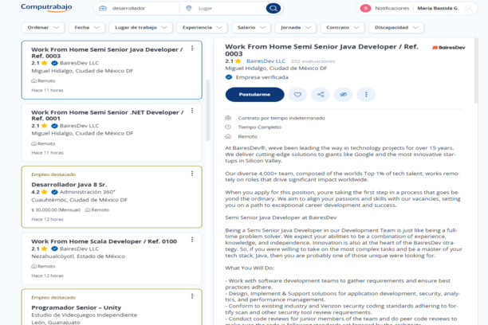
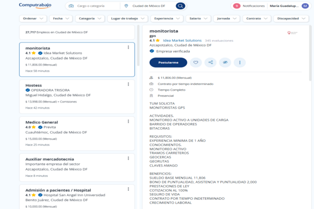

# NoBairesDev – Extensión para filtrar ofertas de BairesDev en Computrabajo

**NoBairesDev** es una extensión para navegadores basada en Chromium (como Opera, Chrome y Edge) que oculta automáticamente las ofertas de empleo publicadas por **BairesDev LLC** en el sitio [Computrabajo México](https://mx.computrabajo.com).

> ⚠️ Esta extensión no recopila ni transmite ningún tipo de información personal.

---

## 🧩 ¿Qué hace?

Esta extensión detecta y oculta visualmente los resultados de búsqueda que pertenecen a BairesDev LLC cuando navegas en Computrabajo.

---

## 📸 Capturas de pantalla

### Antes de activar la extensión:

### Después de activar la extensión:

---
## 🔧 Instalación con Opera
Pendiente de aprobación

## 🔧 Instalación manual

Puedes instalar la extensión manualmente en cualquier navegador basado en Chromium siguiendo estos pasos:

### En Chrome, Edge u Opera:

1. Descarga o clona este repositorio.
2. Descomprime el contenido (si es un ZIP).
3. Ve a:
   - `chrome://extensions` (Chrome)
   - `edge://extensions` (Edge)
   - `opera://extensions` (Opera)
4. Activa el **modo desarrollador**.
5. Haz clic en **“Cargar descomprimida”** y selecciona la carpeta donde están los archivos de la extensión.

---

## 📂 Archivos principales

- `manifest.json` – configuración de la extensión
- `content.js` – script que filtra las ofertas de BairesDev
- `icon128.png` – ícono de la extensión
- `screenshots/` – imágenes demostrativas

---

## 🛡️ Política de privacidad

Esta extensión no recopila, almacena ni transmite ningún dato del usuario. Funciona únicamente dentro del navegador, modificando la visualización de una página específica de forma local.

---

## 📄 Licencia

Este proyecto está licenciado bajo la [Licencia Apache 2.0](https://www.apache.org/licenses/LICENSE-2.0).

---

## ✨ Autor

Desarrollado por **María Bastida **.
